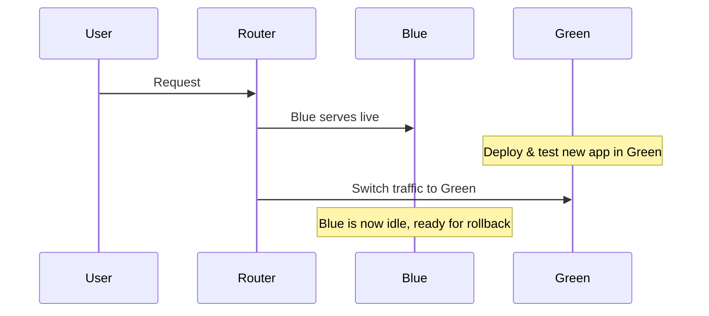

# Blue-Green Deployment Guide

---

## 1. What is Blue-Green Deployment?

**Blue-Green Deployment** is a release management strategy designed to minimize downtime and risk by maintaining two identical production environments — **Blue** and **Green**. At any given time, only one environment (commonly Blue) actively serves live traffic, while the other (Green) stands by, ready to take over with the new version.

**How it works:**
- Deploy and test the new version in the idle (Green) environment.
- Once ready, redirect all user traffic to Green.
- The previous environment (Blue) becomes idle, providing an instant rollback path if needed.

---

## 2. Why Use Blue-Green Deployment?

- **Zero Downtime:** Users experience seamless upgrades.
- **Instant Rollback:** Quickly revert to the last stable version.
- **Production-like Testing:** Validate changes in an environment identical to production before exposing them to users.
- **Risk Mitigation:** Only one environment is exposed to live users at a time, reducing blast radius in case of issues.
- **Simplified Release Management:** Clear separation of "current" and "next" versions.

---

## 3. Core Concepts

| Term            | Description                                                                 |
|-----------------|-----------------------------------------------------------------------------|
| **Blue**        | Active environment serving production traffic.                              |
| **Green**       | Staging environment for the new version, not live until traffic is switched.|
| **Switch-over** | The action of redirecting users from Blue to Green.                         |
| **Rollback**    | Reverting user traffic from Green back to Blue if problems occur.           |

---

## 4. Blue-Green Deployment: Step-by-Step Workflow

### Step 1: Blue is Live
- Blue serves all users.
- Green is idle or non-existent.

### Step 2: Deploy to Green
- Clone Blue to create Green (matching infra, configs, data).
- Deploy new application version to Green.
- Run comprehensive tests (integration, smoke, performance).

### Step 3: Switch Traffic
- Update DNS, router, or load balancer to direct all traffic to Green.
- Green is now live; Blue moves to standby state.

### Step 4: Monitor and Rollback
- Deeply monitor for errors, performance issues, and user feedback.
- Instantly roll back to Blue if necessary by redirecting traffic.

### Step 5: Clean Up
- Decommission or repurpose Blue after confirming Green is stable.
- Optionally, keep Blue as a backup for a defined period.

---

## 5. Visualizing Blue-Green Workflow

### Before Deployment

```mermaid
graph LR
    User --> LB[Load Balancer]
    LB --> Blue[Blue (Live)]
    LB -.-> Green[Green (Idle)]
```

### After Deployment

```mermaid
graph LR
    User --> LB[Load Balancer] --> Green[Green (Live)]
    Blue[Blue (Idle)]
```

### Maintenance Window Scenario

```mermaid
graph LR
    User --> LB[Load Balancer]
    LB --> Maint[Maintenance Page]
    Maint --> Green[Green (Live)]
    Blue -.-> Maint
```
### Sequence Diagram


---

## 6. Database and State Management

### Database Strategies

- **Single Shared Database** (most common):
  - Both Blue and Green point to the same database.
  - All schema changes must be backward- and forward-compatible.
  - Avoid destructive migrations; prefer additive changes (e.g., add columns, never remove).
  - For large migrations, use a maintenance window.

- **Separate Databases** (rare, advanced):
  - Blue and Green each have their own database.
  - Increases complexity (data consistency, replication, migration).
  - Only for advanced use cases.

### Handling Application State

- **Sessions:** Store sessions in external, shared stores (e.g., Redis, Memcached). Never store sessions in application memory.
- **Schema Changes:** Design migrations to be non-breaking. When not possible, use a maintenance window with a static page for users.
- **Cache:** Ensure caches are externalized or can be safely rebuilt across environments.

---

## 7. Rollback and Maintenance

- **Instant Rollback:** If Green fails post-switch, immediately route traffic back to Blue.
- **Database Rollback:** Only possible if migrations are reversible and no destructive changes have occurred.
- **Maintenance Mode:** For major schema changes, temporarily show a maintenance page during migration, then switch to Green.

---

## 8. Best Practices

- **Automate Everything:** Use CI/CD pipelines for building, testing, deploying, and switching environments.
- **Health Checks:** Only switch after Green passes all automated and manual health checks.
- **Comprehensive Monitoring:** Log errors, performance metrics, and user feedback.
- **Backups:** Always back up databases and configurations before deployment.
- **Resource Cleanup:** Remove unused environments and resources to control costs.
- **Documentation:** Document each switch, rollback, and incident for future reference.

---

## 9. Real-World Example: Cloud Foundry

Assume your app is `demo-time`:

1. **Deploy Blue**
   ```shell
   cf create-route example.com --hostname demo-time
   cf push Blue
   cf map-route Blue example.com --hostname demo-time
   ```

2. **Deploy Green (Temp Route)**
   ```shell
   cf create-route example.com --hostname demo-time-temp
   cf push Green
   cf map-route Green example.com --hostname demo-time-temp
   ```

3. **Map Main Route to Green**
   ```shell
   cf map-route Green example.com -n demo-time
   ```
   Both Blue and Green now serve the main route until you unmap Blue.

4. **Unmap Blue**
   ```shell
   cf unmap-route Blue example.com -n demo-time
   ```

5. **Clean Up Temp Route**
   ```shell
   cf unmap-route Green example.com -n demo-time-temp
   cf delete-route example.com --hostname demo-time-temp
   ```

**Tip:** Automate this process with the [cf-blue-green-deploy plugin](https://github.com/bluemixgaragelondon/cf-blue-green-deploy).

---

## 10. Advanced Techniques

- **Preview Endpoints:** Expose Green to internal users or QA for pre-release validation.
- **Gradual Traffic Shift:** Use weighted load balancers to slowly ramp up traffic to Green (Canary Deployment).
- **Autoscaling:** Scale Green to match expected load before switching.
- **Timeboxing:** Limit how long both environments run in parallel to control costs.
- **Feature Flags:** Combine with feature toggles for finer-grained control during the switch.

---

## 11. Limitations & When Not to Use Blue-Green

| Avoid Blue-Green If...                      | Why                                                                |
|---------------------------------------------|--------------------------------------------------------------------|
| Major/breaking database changes             | Both environments share a DB; incompatible schema breaks both      |
| In-memory or sticky sessions                | Switching environments loses user state                            |
| High infrastructure costs                   | Running duplicate environments is expensive                        |
| Highly coupled microservices                | Partial switches can cause incompatibilities                       |
| Large persistent data volumes               | Data synchronization is difficult and risky                        |

**Alternatives:** Consider rolling, canary, or shadow deployments for these scenarios.

---

## 12. Popular Tools & Platforms

- **Cloud Providers:** AWS Elastic Beanstalk, Azure App Service, Google App Engine
- **Containers/Orchestration:** Kubernetes (using Services and Deployments), Docker Swarm
- **CI/CD:** Jenkins, GitHub Actions, GitLab CI/CD, ArgoCD, Spinnaker
- **Load Balancers:** NGINX, HAProxy, AWS ALB/ELB
- **Automation Plugins:** cf-blue-green-deploy (Cloud Foundry), [Argo Rollouts](https://argo-rollouts.readthedocs.io/en/stable/) (K8s)

---

## 13. Blue-Green Deployment Cheat Sheet

| Step             | Action                                                      |
|------------------|------------------------------------------------------------|
| Deploy Green     | Provision, deploy, and thoroughly test new version         |
| Switch Traffic   | Route all users to Green via DNS/LB/router                 |
| Monitor          | Watch logs, metrics, and user feedback after switch        |
| Rollback         | Instantly switch back to Blue if issues are found          |
| Clean up         | Update or remove Blue, prepare for next release cycle      |

---

## 14. References

- [Martin Fowler: Blue-Green Deployment](https://martinfowler.com/bliki/BlueGreenDeployment.html)
- [Cloud Foundry Blue-Green Deployments](https://docs.cloudfoundry.org/devguide/deploy-apps/blue-green.html)
- [AWS Blue/Green Deployments](https://docs.aws.amazon.com/elasticbeanstalk/latest/dg/using-features.deploy-existing-version.html)
- [GitHub: cf-blue-green-deploy](https://github.com/bluemixgaragelondon/cf-blue-green-deploy)
- [RedHat: Blue-Green vs. Canary Deployments](https://www.redhat.com/en/topics/devops/what-is-blue-green-deployment)
- [Argo Rollouts (Kubernetes)](https://argo-rollouts.readthedocs.io/en/stable/)

---
