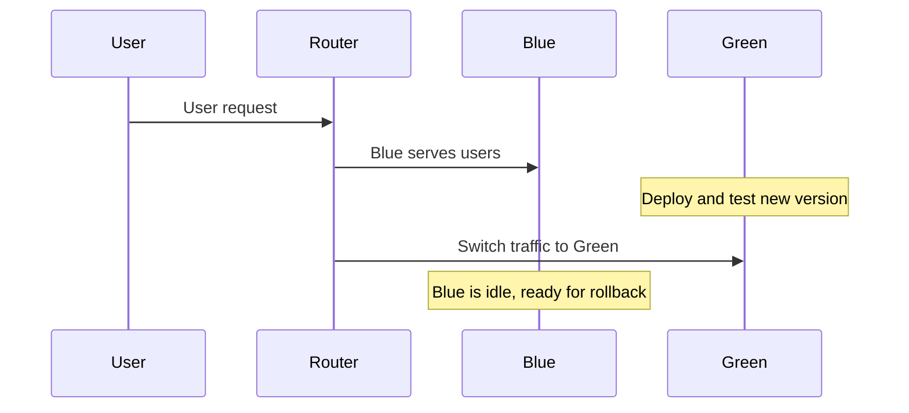

# Blue-Green Deployment: The Ultimate Beginner-to-Advanced Guide 🚦

---

## 1. What is Blue-Green Deployment?
**Blue-Green Deployment** is a deployment strategy used in Kubernetes to minimize downtime and reduce the risk associated with 
deploying new versions of an application. It involves running two identical production environments, referred to as "Blue" and "Green,"
where only one environment is live at any given time.
**Blue** (current live) and **Green** (next version).

- **Blue**: The active, live environment serving all user traffic.
- **Green**: The updated environment, fully tested and ready to take over.

### 🔄 How It Works

1. **Deploy**: Launch new changes to Green.
2. **Test**: Validate Green in a production-like setting.
3. **Switch**: Instantly reroute all traffic from Blue to Green.
4. **Fallback**: Keep Blue on standby for rapid rollback if needed.
---

## 2. Why Use Blue-Green Deployment?

- ✅ **Zero Downtime**: Users experience a seamless transition.
- ⚡ **Instant Rollback**: Switch back to Blue with a single command.
- 📉 **Reduced Risk**: Only one version is live at a time.
- 🧪 **Production-level Testing**: Green is tested as if it’s live.
- 🗂️ **Clear Version Control**: Maintain clean, trackable releases.
- 🛡️ **Safe Experimentation**: Confidently try new features.

---

## 3. Key Concepts & Terms

| Term            | Definition                                                |
| --------------- | -------------------------------------------------------- |
| **Blue**        | Current production environment                           |
| **Green**       | New version, tested and ready for production             |
| **Switch-over** | Redirecting all traffic from Blue to Green               |
| **Rollback**    | Instantly shifting traffic back to Blue if Green fails   |
| **Routing**     | DNS or load balancer rules that control user traffic     |
| **Idle State**  | The environment not handling traffic (standby)           |

---

## 4. The Blue-Green Deployment Lifecycle

1. **Initial State**
   - Blue serves all traffic.
   - Green is idle or does not exist.

2. **Deploy Green**
   - Duplicate Blue’s environment.
   - Deploy and test the new application in Green.

3. **Switch Traffic**
   - Update routing/DNS/load balancer to Green.
   - Green now serves all users.

4. **Monitor**
   - Watch metrics, logs, and user experience closely.
   - Rollback to Blue if any issues are detected.

5. **Clean Up**
   - Decommission Blue or keep as a backup for rapid rollback.

---

## 5. Visual Guide



---

## 6. Database & Application State

### Database Strategies

- **Shared Database (Recommended):**
  - All environments connect to the same DB.
  - Ensure *backward-compatible* schema changes (e.g., no dropping columns, only adding).
  - Use expand-and-contract pattern for DB migrations.

- **Separate Database (Advanced Use):**
  - Each environment has its own DB.
  - Increases complexity for syncing and data consistency.
  - Rarely used except in stateless or experimental setups.

### Session Management

- Use shared session stores (**Redis**, **Memcached**, etc.).
- Never store sessions locally on app instances.

### Caching

- Use distributed caches.
- Pre-warm Green’s cache before switching.

---

## 7. Rollback & Maintenance

- ⏪ **Instant Rollback**: Switch router/DNS/load balancer back to Blue.
- 🛑 **Database Reversion**: Only possible if migrations are reversible.
- 🕒 **Maintenance Mode**: Activate during non-backward-compatible DB updates.
- 🔄 **Automated Rollback**: Integrate health checks to auto-rollback on failure.

---

## 8. Best Practices

- 🚀 **Automate Deployments**: Use CI/CD pipelines for repeatability.
- 🔍 **Robust Health Checks**: Verify application and dependency status before and after switch.
- 📈 **Continuous Monitoring**: Set up dashboards and alerts for errors, latency, and traffic.
- 💾 **Backups First**: Backup data and configs before any deployment.
- 📝 **Document Everything**: Track changes, rollback steps, and known issues.
- 🔒 **Uniform Security**: Apply identical security rules to both environments.
- 🔢 **Versioning**: Tag and track releases for easy reference.

---

## 9. Cloud Foundry Example

### Step-by-Step Blue-Green Deployment

```shell
# Step 1: Deploy Blue
cf push Blue
cf map-route Blue example.com --hostname demo-time

# Step 2: Deploy Green
cf push Green
cf map-route Green example.com --hostname demo-time-temp

# Step 3: Promote Green
cf map-route Green example.com -n demo-time

# Step 4: Demote Blue
cf unmap-route Blue example.com -n demo-time

# Step 5: Clean Up
cf unmap-route Green example.com -n demo-time-temp
cf delete-route example.com --hostname demo-time-temp
```
---

## 10. Advanced Patterns & Tips

- 🔗 **Preview URLs:** Share Green with QA/stakeholders before going live.
- 🕹️ **Feature Flags:** Enable/disable new features post-deployment without redeploying.
- 🦾 **Canary Rollouts:** Gradually shift traffic from Blue to Green for safer transitions.
- 🌍 **Geo Routing:** Switch only a region or subset of users first.
- 🚦 **Autoscaling:** Confirm that Green auto-scales under production loads.
- 🧪 **A/B Testing:** Use Blue-Green to facilitate experiments with real traffic.

---

## 11. When Blue-Green Isn’t Ideal

| Situation                       | Limitation                                         | Alternative                                  |
| ------------------------------- | -------------------------------------------------- | --------------------------------------------- |
| Breaking DB changes             | Shared DB can’t support incompatible versions      | Rolling Deployments, Feature Toggles          |
| Sticky sessions                 | Session loss during switch                         | Centralized Session Store, Sticky Load Balancing|
| Cost-sensitive environments     | Duplicating infra may double costs                 | Rolling/Canary Deployments                    |
| Large-scale distributed systems | Coordinating many services is challenging          | Staged/Phased Deployments                     |
| Stateful services               | Hard to keep state between versions                | In-place Upgrades, Specialized Orchestration   |

---

## 12. Tooling & Platform Support

### Cloud Providers

- **AWS**: Elastic Beanstalk, ECS, CodeDeploy, App Runner
- **Azure**: App Service Slots, AKS
- **GCP**: App Engine, Cloud Run, GKE

### Containers & Orchestration

- **Kubernetes**: [Argo Rollouts](https://argo-rollouts.readthedocs.io/en/stable/), Helm, native services
- **Docker Swarm**: Overlay networks for blue and green stacks

### CI/CD & Automation

- GitHub Actions, GitLab CI, Jenkins, Spinnaker, CircleCI

### Load Balancers

- NGINX, HAProxy, AWS ALB/ELB, GCP Load Balancer, Traefik

### Plugins & Tools

- [`cf-blue-green-deploy`](https://github.com/bluemixgaragelondon/cf-blue-green-deploy)
- [K8s Blue-Green](https://github.com/WeAreFairphone/k8s-blue-green-deployment)

---

## 13. Blue-Green Quick Reference

| Step               | Action                                       | Checklist                                |
| ------------------ | -------------------------------------------- | ---------------------------------------- |
| **Deploy Green**   | Deploy and test new environment              | ✅ Health checks, ✅ DB migrations        |
| **Switch Traffic** | Update routing/load balancer to Green        | ✅ DNS/Route config updated              |
| **Monitor**        | Watch metrics, logs, and user feedback       | ✅ Errors, ✅ Latency, ✅ User reports     |
| **Rollback**       | Reroute traffic to Blue if needed            | ✅ Scripted or automated                 |
| **Clean Up**       | Decommission or repurpose Blue               | ✅ Infra costs reduced, ✅ Ready for next |

---

## 14. Resources & Further Reading

- [AWS Blue/Green Deployments](https://docs.aws.amazon.com/elasticbeanstalk/latest/dg/using-features.deploy-existing-version.html)
- [Cloud Foundry Blue-Green Deployment](https://docs.cloudfoundry.org/devguide/deploy-apps/blue-green.html)
- [Argo Rollouts (Kubernetes)](https://argo-rollouts.readthedocs.io/en/stable/)
- [RedHat: What is Blue-Green Deployment?](https://www.redhat.com/en/topics/devops/what-is-blue-green-deployment)
- [Azure: Blue-Green Deployments](https://learn.microsoft.com/en-us/azure/architecture/guide/deployment/blue-green)
- [Google Cloud: Deployment Strategies](https://cloud.google.com/architecture/deployment-strategies)
- [CI/CD Best Practices](https://www.ci-cd.dev/)

---
