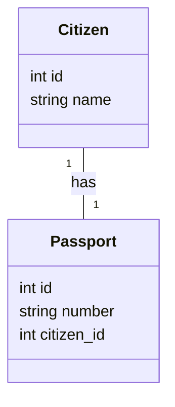
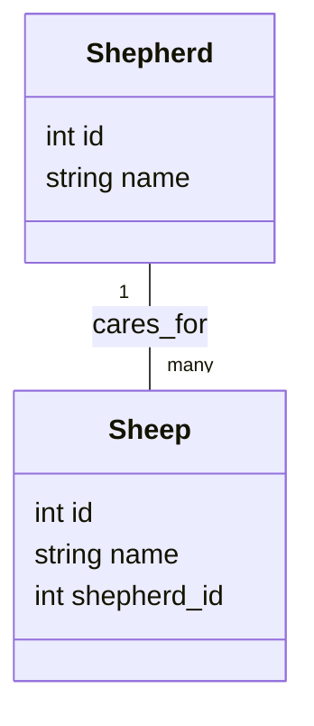
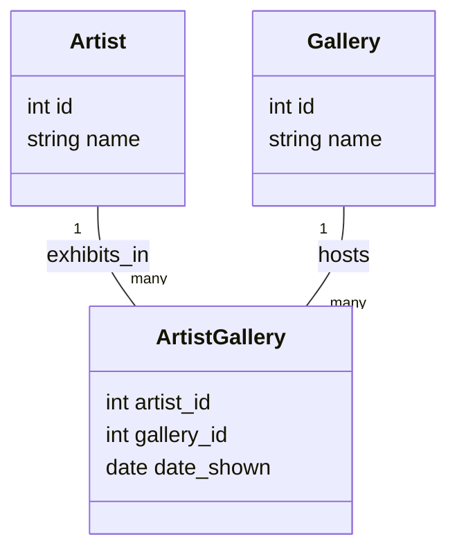
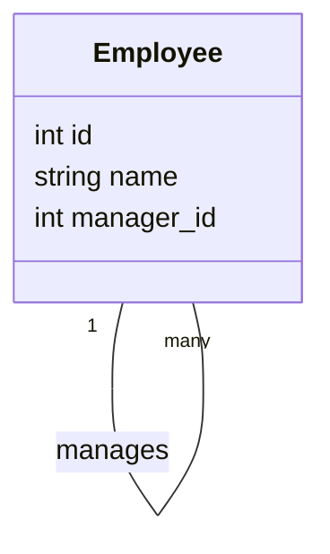
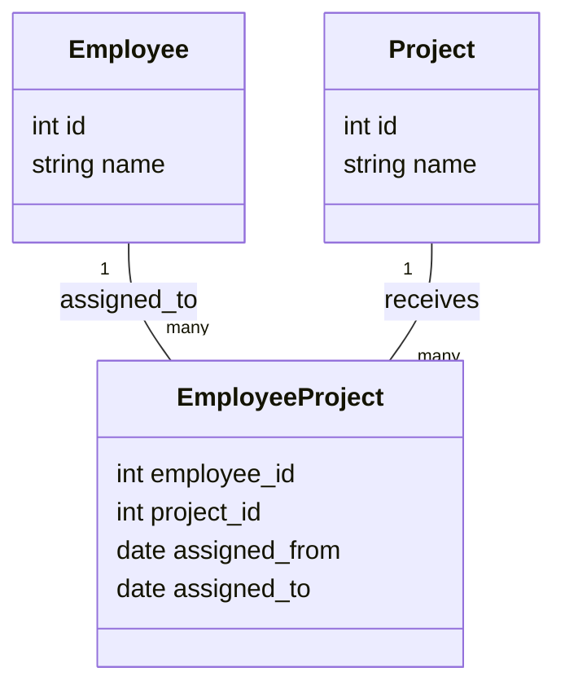
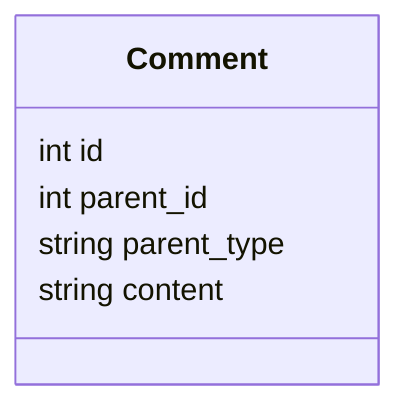
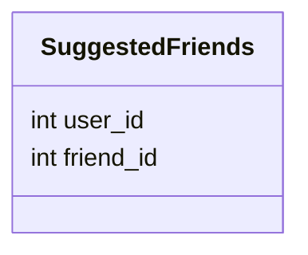

# The Secret Life of Database Relationships: An Unconventional Guide 🚀

## Introduction

In relational databases, a **relationship** defines how two or more tables are logically connected. Relationships are the *stories* of your data—woven into how you organize, protect, and retrieve information.  
This guide is your illustrated, analogy-rich, quick-scan companion to mastering relationships: whether you’re a beginner, a non-technical reader, or an expert who loves clear guides.

---

## 1. The DNA of a Relationship

Every relationship is a *promise* between tables:

- **Identity:** Who are you?
- **Purpose:** Why do we connect?
- **Lifespan:** What if one of us disappears?

> **Think of a relationship as a strand of DNA—its structure determines how your data lives, evolves, and adapts.**

---

## 2. Relationship Archetypes (With Diagrams, Stories, SQL, and Queries)

### A. 👤🔗🪪 The Guardian (One-to-One)

**Story:**  
A passport is issued to one citizen, and a citizen can hold only one current passport.

#### **Diagram** 


*Each **Citizen** has one unique **Passport**, and vice versa.*

**Key Points:**
- Use a `UNIQUE` foreign key in one table to enforce 1:1.
- Usually, the less-important or optional table owns the relationship.

#### **SQL Example**
```sql
CREATE TABLE citizen (
    id SERIAL PRIMARY KEY,
    name TEXT
);

CREATE TABLE passport (
    id SERIAL PRIMARY KEY,
    number VARCHAR(20) UNIQUE,
    citizen_id INT UNIQUE REFERENCES citizen(id)
);
```

#### **Sample SELECT**
```sql
-- Find the passport number for Alice
SELECT passport.number
FROM passport
JOIN citizen ON passport.citizen_id = citizen.id
WHERE citizen.name = 'Alice';
```

#### **When to Use:**  
- Sensitive/private extensions (user + settings, employee + confidential record)
- Physical objects with unique owners (passport, car title, etc.)

---

### B. 👨‍👧‍👦 The Flock (One-to-Many)

**Story:**  
A shepherd cares for many sheep, but each sheep belongs to only one shepherd.

#### **Diagram**


**Key Points:**
- The "many" side holds the foreign key.
- Enforce what happens on deletion: restrict, cascade, or nullify.

#### **SQL Example**
```sql
CREATE TABLE shepherd (
    id SERIAL PRIMARY KEY,
    name TEXT
);

CREATE TABLE sheep (
    id SERIAL PRIMARY KEY,
    name TEXT,
    shepherd_id INT REFERENCES shepherd(id) ON DELETE SET NULL
);
```

#### **Sample SELECT**
```sql
-- Get all sheep cared for by Miriam
SELECT sheep.name
FROM sheep
JOIN shepherd ON sheep.shepherd_id = shepherd.id
WHERE shepherd.name = 'Miriam';
```

#### **When to Use:**  
- Parent-child relationships (users and posts, departments and employees)
- Ownership, composition, categorization

---

### C. 🧑‍🎨🖼️🏛️ The Marketplace (Many-to-Many)

**Story:**  
Artists can display in many galleries, and galleries can feature many artists.

#### **Diagram**


**Key Points:**
- The join table holds both FKs and can contain additional relationship data (e.g., `date_shown`).
- Many-to-many is always **explicit** in SQL.

#### **SQL Example**
```sql
CREATE TABLE artist (
    id SERIAL PRIMARY KEY,
    name TEXT
);

CREATE TABLE gallery (
    id SERIAL PRIMARY KEY,
    name TEXT
);

CREATE TABLE artist_gallery (
    artist_id INT REFERENCES artist(id),
    gallery_id INT REFERENCES gallery(id),
    date_shown DATE,
    PRIMARY KEY (artist_id, gallery_id)
);
```

#### **Sample SELECT**
```sql
-- List all galleries where Asha's art has been displayed
SELECT gallery.name, artist_gallery.date_shown
FROM artist_gallery
JOIN gallery ON artist_gallery.gallery_id = gallery.id
JOIN artist ON artist_gallery.artist_id = artist.id
WHERE artist.name = 'Asha';
```

#### **When to Use:**  
- Tags on posts, students in classes, actors in movies, products in orders

---

### D. 🧑‍💼↔️🧑‍💼 The Biographer (Self-Referencing/Hierarchy)

**Story:**  
An employee may report to another employee.

#### **Diagram**


**Key Points:**
- The foreign key points back to the same table (recursive).
- Allows for hierarchy, trees, or graph structures.

#### **SQL Example**
```sql
CREATE TABLE employee (
    id SERIAL PRIMARY KEY,
    name TEXT,
    manager_id INT REFERENCES employee(id)
);
```

#### **Sample SELECT**
```sql
-- List all direct reports to Alice
SELECT e2.name AS report
FROM employee e1
JOIN employee e2 ON e2.manager_id = e1.id
WHERE e1.name = 'Alice';
```

---

## 3. Exotic & Advanced Relationship Patterns

### 🕰️ The Time Traveler (Temporal Many-to-Many)

**Story:**  
An employee is assigned to projects, but only for certain dates.

#### **Diagram**


#### **SQL Example**
```sql
CREATE TABLE employee_project (
    employee_id INT REFERENCES employee(id),
    project_id INT REFERENCES project(id),
    assigned_from DATE,
    assigned_to DATE,
    PRIMARY KEY (employee_id, project_id, assigned_from)
);
```

#### **Sample SELECT**
```sql
-- Who was working on Project X on 2024-06-01?
SELECT employee.name
FROM employee_project
JOIN employee ON employee_project.employee_id = employee.id
JOIN project ON employee_project.project_id = project.id
WHERE project.name = 'Project X'
  AND '2024-06-01' BETWEEN employee_project.assigned_from AND employee_project.assigned_to;
```

---

### 💬📸📝 The Polygamist (Polymorphic)

**Story:**  
A comment can belong to a blog post, a photo, or a video.

#### **Diagram**

*Enforce referential logic in the application layer.*

#### **SQL Example**
```sql
CREATE TABLE comments (
    id SERIAL PRIMARY KEY,
    parent_id INT,
    parent_type VARCHAR(20), -- e.g., 'post', 'photo', 'video'
    content TEXT
);
```

#### **Sample SELECT**
```sql
-- Get all comments for photo with id 99
SELECT content
FROM comments
WHERE parent_type = 'photo' AND parent_id = 99;
```

---

### 👥❓ The Butterfly Effect (Soft Relationships)

**Story:**  
A "suggested friends" feature—potential relationships, not enforced.

#### **Diagram**

*No foreign key constraints; all fields nullable.*

#### **Sample SELECT**
```sql
-- Who are the suggested friends for user 7?
SELECT friend_id
FROM suggested_friends
WHERE user_id = 7;
```

---

## ⚠️ Common Mistakes ("Gotchas" for Beginners)

* ❌ Not indexing foreign keys → 🔄 Slow JOINs
* ❌ Using composite keys without a real need
* ❌ Forgetting ON DELETE rules → 🧨 Orphaned records or broken integrity
* ❌ Relying only on app logic for polymorphic relationships
* ❌ Confusing One-to-Many and Many-to-Many patterns

---

## 🧠 Try This! (Interactive Prompts)

* Modify the `employee` table to allow multi-level reporting chains and query the full chain for an employee.
* Add a new gallery and assign three artists to it using `artist_gallery`.
* Write a query to find all orphaned sheep (sheep without a shepherd).
* Use a temporal join table to find all employees who worked on a project during a given month.

---

## 📘 Analogy Sidebars

> **Foreign Key Analogy:**  
> A foreign key is like writing someone’s name in your address book. The relationship only works if they exist in the “main” book!

> **Join Table Analogy:**  
> Think of a join table as a guest list at a party—it records **who** was at **which** event and maybe even **when**.

---

## 6. Relationship Lifecycle Tactics (How Relationships Change)

- **ON DELETE CASCADE:** Remove all dependents when a row is deleted (e.g., delete all sheep when a shepherd leaves).
- **ON DELETE SET NULL:** Keep dependents but mark them as orphans.
- **NO ACTION/RESTRICT:** Prevent deletion if dependents exist.

> **Tip:**  
> Always think about what should happen to related data when a "parent" is deleted—this determines if orphans, cascades, or restrictions are best.

---

## 7. Visualizing Relationships: The “Story Map”

- Draw tables as *characters* (with columns as traits).
- Draw relationships as arrows labeled with verbs: “owns”, “belongs to”, “manages”.
- Annotate with lifespan and rules (“If X is deleted, Y becomes an orphan”).
- Use ASCII or Mermaid diagrams for clarity and shareability.
---

## 8. Common Pitfalls and Best Practices

- **Always index foreign keys** for performance.
- **Document relationship logic** (what happens on delete?).
- **Prefer explicit join tables** for anything more complex than trivial many-to-many.
- **Use CHECK constraints** and triggers for enforcing business rules that can’t be written as FKs.
- **Plan for change:** Data models evolve—build relationships you can refactor or extend.

---

## 9. Real-World Relationship Design Checklist

- [ ] Does each table have a clear purpose and identity?
- [ ] Is every relationship necessary, or is it an artifact of a bad design?
- [ ] Have I considered what should happen when a parent is deleted?
- [ ] Are there any “soft” or “potential” relationships needing nullable fields?
- [ ] Did I add indexes for all FKs and join columns?
- [ ] Are all many-to-many relationships explicit with join tables?
- [ ] Is documentation (diagram, story map) up to date?

---

## 10. In Summary

- **One-to-One:** Use for exclusive, private extensions of data.
- **One-to-Many:** The classic parent-child.
- **Many-to-Many:** When everyone can meet everyone—with a join table as your guestbook!
- **Self-Referencing:** Model hierarchies and trees.
- **Temporal & Polymorphic:** Add nuance and flexibility to your data model.

> **Database design is storytelling. Draw your characters, set their relationships, and let your data live its best life.**

---

## 🔥 TL;DR: Relationship Cheat Sheet

| Type             | 🔗 Icon/Emoji                  | Foreign Key Location        | Use Case Example         |
| ---------------- | ----------------------------- | -------------------------- | ------------------------ |
| One-to-One       | 👤🔗🪪 (Person to ID)          | Either table (with UNIQUE) | User ↔️ Settings         |
| One-to-Many      | 👨‍👧‍👦 (Parent to Children)   | “Many” side                | Customer → Orders        |
| Many-to-Many     | 🧑‍🎨🖼️🏛️ (Artists-Galleries) | Join table                 | Students ↔️ Courses      |
| Self-Referencing | 🧑‍💼↔️🧑‍💼 (Manager-Employee)  | Same table (manager\_id)   | Employee → Manager       |
| Temporal N:M     | 🕰️ (Time-bound roles)         | Join + date columns        | Employee ↔️ Project      |
| Polymorphic      | 💬📸📝 (Comment on anything)   | `parent_type` + `parent_id`| Comments on any content  |
| Soft             | 👥❓ (Suggested Friends)        | Nullable/no FKs            | Friend Suggestions       |

---

## ⚡️ Quick Visual Key

- 👤 = One person/entity
- 🪪 = ID/passport
- 👨‍👧‍👦 = Parent with children
- 🧑‍🎨 = Artist
- 🖼️ = Art
- 🏛️ = Gallery
- 🧑‍💼 = Employee
- 💬 = Comment
- 📸 = Photo
- 📝 = Blog
- 🕰️ = Time
- 👥 = People
- ❓ = Suggestion

---

**🌟 Share this guide, fork it, or remix for your own team/project. Happy modeling! 🌟**
