# Java Backend Development - Modern Comprehensive Syllabus (2025, Expanded)

## Overview
This syllabus integrates current and emerging job trends with core Java backend skills, spanning from Java fundamentals to the advanced Spring ecosystem, DevOps, microservices, cloud-native development, AI integration, and beyond. It is structured for both beginners and experienced developers, emphasizing hands-on projects, modern tools, and career readiness—including certifications and portfolio-building.

---

```mermaid
flowchart TD
    Start([Java Backend Development - Modern Syllabus 2025])

    %% Module 1
    subgraph M1 [Module 1: Introduction & Tools]
      direction TB
      M1A(Backend Concepts: Benefits, Use Cases, MEAN/MERN vs Java, Frameworks)
      M1B(Tools: VS Code, IntelliJ, Git, Workflows, Postman, Swagger)
      M1C(Java Setup: JDK, IDE, Maven, Gradle, Portability, Modules)
      M1A --> M1B --> M1C
    end

    %% Module 2
    subgraph M2 [Module 2: Core Java & OOP]
      direction TB
      M2A(Java Fundamentals: Variables, Types, Operators, Loops, Conditionals, Input, Javadoc)
      M2B(OOP: Class, Object, Encapsulation, Inheritance, Polymorphism, JVM Memory, Overloading, Modifiers, Immutability)
      M2A --> M2B
    end

    %% Module 3
    subgraph M3 [Module 3: Arrays, Strings, Functional]
      direction TB
      M3A(Arrays: 1D, 2D, Jagged, Enhanced for, Utilities, Pitfalls)
      M3B(Strings: Immutability, Manipulation, Regex, Algorithms, Formatting)
      M3C(Functional: Lambdas, Interfaces, Streams, Optionals, Inner Classes, Abstract vs Interface)
      M3A --> M3B --> M3C
    end

    %% Module 4
    subgraph M4 [Module 4: Exception & Multithreading]
      direction TB
      M4A(Exception Handling: Types, Hierarchy, try-catch, throw, Logging)
      M4B(Multithreading: Thread, Runnable, Executors, Parallel, Virtual Threads)
      M4A --> M4B
    end

    %% Module 5
    subgraph M5 [Module 5: Collections, Generics, Enums]
      direction TB
      M5A(Collections: List, Set, Queue, Map, Iterators, Concurrent)
      M5B(Generics: Types, Methods, Wildcards)
      M5C(Enums: Enum Methods, EnumSet, EnumMap)
      M5A --> M5B --> M5C
    end

    %% Module 6
    subgraph M6 [Module 6: File I/O & Annotations]
      direction TB
      M6A(File I/O: File, Streams, NIO, Serialization, CSV, JSON, YAML)
      M6B(Annotations: Built-in, Custom, Reflection, Spring, Hibernate)
      M6A --> M6B
    end

    %% Module 7
    subgraph M7 [Module 7: JDBC, ORM, Databases]
      direction TB
      M7A(JDBC: Drivers, CRUD, Transactions, Pooling)
      M7B(ORM: Hibernate, JPA, Entities, Relations, JPQL, Migrations)
      M7C(Databases: SQL, Joins, NoSQL, MongoDB, Redis)
      M7A --> M7B --> M7C
    end

    %% Module 8
    subgraph M8 [Module 8: Maven & Project Mgmt]
      direction TB
      M8A(Maven: Setup, pom.xml, Multi-module, Lifecycle, Gradle)
    end

    %% Module 9
    subgraph M9 [Module 9: Spring & Enterprise Java]
      direction TB
      M9A(Spring Core/Boot: IoC, Beans, Config, DevTools)
      M9B(Spring Data JPA: Repos, Paging, QueryDSL)
      M9C(Spring MVC/WebFlux: REST, Validation, Reactive)
      M9D(Spring Security: Auth, OAuth2, JWT, CORS)
      M9E(Spring AI: LLM APIs, OpenAI, Recommendations)
      M9F(Microservices: Eureka, Config, Kafka, RabbitMQ, Tracing)
      M9G(Spring Batch, GraphQL, gRPC, Resilience4j)
      M9A --> M9B --> M9C --> M9D --> M9E --> M9F --> M9G
    end

    %% Module 10
    subgraph M10 [Module 10: DevOps, CI/CD, Cloud]
      direction TB
      M10A(DevOps: Jenkins, GitHub Actions, Docker, K8s, Helm, Swarm)
      M10B(Cloud: AWS, GCP, Azure, IaC, Monitoring, SRE, GitOps, OpenTelemetry, Serverless)
      M10A --> M10B
    end

    %% Module 11
    subgraph M11 [Module 11: Projects & Practice]
      direction TB
      M11A(Projects: Beginner, Intermediate, Advanced, DevOps)
      M11B(Practice: Algorithms, Patterns)
      M11C(Architecture: DDD, Hexagonal)
      M11D(Ideas: AI CRM, FinTech, Real-time Editor, AI Learning)
      M11E(Career: Interviews, Resume, Portfolio, Blogging)
      M11A --> M11B --> M11C --> M11D --> M11E
    end

    %% Module 12
    subgraph M12 [Module 12: Interview & Readiness]
      direction TB
      M12A(Core Java, OOP, DSA)
      M12B(Spring, Microservices, DevOps)
      M12C(Security, i18n, Testing)
      M12D(Bonus: Quarkus, WASM, Server Push)
      M12E(Certification: OCJP, Spring, Cloud, Docker/K8s, OpenAI)
      M12A --> M12B --> M12C --> M12D --> M12E
    end

    %% Connections
    Start --> M1
    Start --> M2
    Start --> M3
    Start --> M4
    Start --> M5
    Start --> M6
    Start --> M7
    Start --> M8
    Start --> M9
    Start --> M10
    Start --> M11
    Start --> M12
```

## Module 1: Introduction to Java & Backend Development

- **Backend Development Concepts**
  - What is backend development? Benefits and real-world applications
  - Comparison of MEAN, MERN, and Java Full Stack
  - Modern backend frameworks overview
  - Backend use cases in 2025 (Cloud, Microservices, AI integration, Serverless)
- **Development Tools**
  - Introduction to VS Code & IntelliJ IDEA for Java
  - Why use Version Control? Git & GitHub Essentials
  - Git branching, merging, and workflows (GitHub Flow, GitFlow)
  - Using Postman for API testing, automation, and sharing (workspaces, environments, scripting)
  - Introduction to API contract tools: Swagger/OpenAPI basics
- **Basic Programming and Java Setup**
  - Setting up Java (JDK 17/21), IDE configuration, build tools overview (Maven/Gradle)
  - Writing and running your first Java program
  - Anatomy of a Java program (`main` method, class structure)
  - How Java achieves portability (JVM, bytecode)
  - Static vs Dynamic typing in Java, variable declaration
  - Working with Java modules (Java Platform Module System)

---

## Module 2: Core Java Programming & OOP

- **Java Fundamentals**
  - Variables, Data Types (Primitive & Reference)
  - Type casting, truncation, and data loss
  - Identifiers & Naming Conventions
  - Operators (arithmetic, logical, relational, increment/decrement)
  - Conditional statements (if, else, switch)
  - Loops (for, while, do-while, enhanced-for)
  - User Input with Scanner class and Console class
  - Java coding standards and documentation (Javadoc)
- **Object-Oriented Programming**
  - Concepts: Class, Object, Encapsulation, Inheritance, Polymorphism, Abstraction
  - JVM memory structure (Heap, Stack, Method Area, etc.)
  - Instance vs Local vs Static variables
  - Method overloading & overriding, constructor overloading
  - Wrapper classes and auto-boxing/unboxing
  - `this` keyword, use cases
  - Static keyword: fields, methods, blocks, initialization
  - Class loading process in Java
  - Access modifiers: public, private, protected, default
  - Packages: creation, use, access control
  - OOP best practices in application design
  - Immutability and design for concurrency

---

## Module 3: Arrays, Strings, and Functional Programming

- **Arrays**
  - Why and when to use arrays
  - Single-dimensional, multi-dimensional (2D/3D), jagged arrays
  - Array declaration, instantiation, initialization
  - Enhanced for-loop (`for-each`)
  - Common pitfalls: ArrayIndexOutOfBoundsException
  - Array utilities: `Arrays` class, sorting, searching
- **Strings**
  - Immutable nature of strings, memory model (String pool)
  - String manipulation (concatenation, substring, split, replace)
  - StringBuilder and StringBuffer for efficient modifications
  - Regular expressions in Java
  - Common string algorithms (palindrome, anagram, etc.)
  - String formatting, parsing, and pattern matching
- **Functional Programming**
  - Anonymous functions & Lambda expressions (Java 8+)
  - Introduction to Functional Interfaces (Predicate, Consumer, Supplier, Function)
  - Method references, streams API basics (filter, map, reduce, collect)
  - Inner classes & anonymous inner classes
  - Abstract class vs Interface: differences & use cases
  - Java 8+ features: default & static methods in interfaces
  - Optionals and functional error handling

---

## Module 4: Exception Handling & Multithreading

- **Exception Handling**
  - Types of errors: compile-time, runtime, logical
  - Exception hierarchy (Throwable, Exception, Error, RuntimeException)
  - try-catch, multiple catch, finally, try-with-resources
  - Custom exceptions, best practices for error handling
  - Exception propagation: handling vs ducking
  - `throw` and `throws` keywords
  - Logging and error reporting strategies
- **Multithreading**
  - Need for multithreading in backend applications
  - The main thread, creating threads (Thread class, Runnable interface, Callable/Future)
  - Thread lifecycle and states
  - join(), isAlive(), interrupt(), sleep()
  - Synchronization: methods, blocks, static sync, locks
  - Deadlock, race conditions, thread safety, atomic variables
  - Producer-consumer problem (wait, notify)
  - Modern concurrency utilities (Executors, Callable, Futures, ForkJoinPool)
  - Introduction to parallel streams
  - Introduction to virtual threads (Project Loom, emerging)

---

## Module 5: Collections, Generics, and Enums

- **Collections Framework**
  - Why collections? Legacy vs Modern collections
  - Collection hierarchy: List, Set, Queue, Deque, Map
  - ArrayList, LinkedList, Vector, Stack
  - HashSet, LinkedHashSet, TreeSet
  - PriorityQueue, ArrayDeque
  - HashMap, LinkedHashMap, TreeMap, Hashtable
  - Iterator & ListIterator, fail-fast vs fail-safe
  - Legacy classes (Enumeration, Properties)
  - Collections utility methods & best practices
  - NavigableMap, NavigableSet, ConcurrentHashMap, CopyOnWriteArrayList
- **Generics**
  - Introduction, benefits and syntax
  - Generic classes, methods, interfaces
  - Upper-bounded, lower-bounded, unbounded wildcards
  - Generics and collections integration
  - Type safety and type erasure
- **Enums**
  - Syntax, benefits, enum constants & methods
  - Using enums in switch statements
  - Enum fields, constructors, and methods
  - valueOf(), values(), ordinal()
  - Enums with interfaces and custom behavior
  - EnumSet, EnumMap

---

## Module 6: File Handling, I/O, and Annotations

- **File Handling & I/O**
  - File operations: create, read, write, update, delete
  - File class, FileReader/FileWriter, BufferedReader/Writer
  - Serialization & Deserialization
  - Java NIO (Paths, Files, Channels, ByteBuffer)
  - Exception handling in file operations
  - Reading/writing CSV, JSON, YAML (using Jackson, Gson)
- **Annotations**
  - Built-in annotations (@Override, @Deprecated, @SuppressWarnings)
  - Custom annotations: creation and usage
  - Reflection and annotation processing
  - Practical use cases in frameworks (Spring, Hibernate, JPA)
  - Repeatable annotations and meta-annotations

---

## Module 7: JDBC, ORM, and Databases

- **JDBC**
  - Introduction, architecture, driver types (Type 1-4)
  - Connecting to databases (MySQL, PostgreSQL, H2, SQLite)
  - CRUD operations with JDBC
  - Statements, PreparedStatements, CallableStatements
  - Batch processing, transactions (commit, rollback)
  - Connection pooling (HikariCP, Apache DBCP)
  - Handling SQL injection and secure database access
- **ORM (JPA & Hibernate)**
  - What is ORM? Advantages over JDBC
  - Hibernate architecture, configuration, annotations vs XML
  - Entity mapping, relationships (OneToOne, OneToMany, ManyToMany)
  - CRUD with Hibernate, JPQL, HQL, Criteria API
  - Caching (First and Second level)
  - JPA annotations, Spring Data JPA basics
  - Flyway and Liquibase for database migrations
- **Databases**
  - SQL basics: SELECT, INSERT, UPDATE, DELETE
  - Joins, subqueries, grouping, aggregate functions
  - Database normalization and denormalization
  - MongoDB basics: CRUD, schemas, projections
  - NoSQL concepts and use cases (Document, Key-Value, Wide-Column, Graph)
  - Introduction to Redis and caching strategies

---

## Module 8: Maven and Project Management

- **Maven**
  - Fundamentals, installation, setup with Eclipse/IntelliJ
  - pom.xml structure, dependencies, plugins
  - Multi-module project setup
  - Build lifecycle, goals, and phases
  - Dependency management and scopes
  - Maven profiles, best practices for reproducible builds
  - Introduction to Gradle as a modern alternative

---

## Module 9: Spring Ecosystem & Modern Enterprise Java

- **Spring Core**
  - Architecture, modules, IoC & Dependency Injection
  - Bean definition, scopes, lifecycle, post-processors
  - Configuration (XML, annotations, Java config)
  - ApplicationContext vs BeanFactory
- **Spring AOP**
  - Fundamentals, cross-cutting concerns, aspect weaving
  - Pointcuts, advices, aspects, proxies
- **Spring Data JPA**
  - Repository interfaces, query methods, custom queries
  - Paging, sorting, transactions
  - Projections, Specifications, QueryDSL basics
- **Spring Web MVC**
  - DispatcherServlet, Controllers, REST endpoints
  - Request mapping, validation, exception handling
  - Content negotiation, HATEOAS, versioning APIs
- **Spring Boot**
  - Rapid development, starters, auto-configuration
  - Profiles, configuration, logging, actuator
  - Building RESTful APIs, testing with Spring Boot
  - Spring Boot DevTools, hot reloading
- **Spring WebFlux (Reactive Programming)**
  - Introduction to reactive paradigm, Mono & Flux
  - Controller development with WebFlux
  - When and why to use WebFlux (high concurrency, async)
  - Backpressure, reactive streams, comparison with traditional MVC
  - Integration with RSocket and WebSockets
- **Spring Security**
  - Authentication, authorization, role-based access
  - OAuth2, JWT, secure REST APIs
  - Integrating Spring Security with OAuth2 providers (Google, GitHub, etc.)
  - Method level security, CORS, CSRF
- **Spring AI (Java AI Integration)**
  - Overview of Spring AI (Spring AI project, 2024+)
  - AI/ML integration in Java backend (embedding, inference, LLM APIs)
  - Connecting to OpenAI, HuggingFace, or local LLMs via Spring AI
  - Use cases: search, recommendation, chatbots, data enrichment
  - Integrating AI into microservices and cloud-native apps
- **Microservices & Cloud**
  - Microservices fundamentals, design patterns (API Gateway, Circuit Breaker, Service Registry)
  - Spring Cloud basics (Eureka, Config Server, Gateway, Bus, Sleuth, Zipkin)
  - REST API versioning, documentation (Swagger/OpenAPI)
  - Event-driven microservices: Kafka, RabbitMQ, and Spring Cloud Stream
  - Service discovery, configuration management, distributed tracing
  - Securing microservices, service mesh basics
- **Spring Batch (for ETL jobs and scheduled large data processing)**
  - Concepts of Job, Step, Chunk-oriented processing
  - Readers, Writers, Processors, Listeners
  - Scheduling batch jobs with Spring Boot
- **Spring GraphQL (Modern API Design)**
  - GraphQL vs REST
  - Query, Mutation, and Subscription with Spring GraphQL
  - GraphQL clients and integrations (e.g., Postman, Altair, Apollo)
- **gRPC Integration**
  - Introduction to gRPC and Protocol Buffers
  - gRPC with Spring Boot
  - Comparison with REST APIs
- **Resilience4j (instead of Hystrix - now deprecated)**
  - Circuit Breaker, Retry, Rate Limiter, Bulkhead
  - Integration with Spring Boot

---

## Module 10: DevOps, CI/CD, Cloud & Modern Tooling

- **DevOps Tools & Practices**
  - Git branching strategies for teams (GitFlow, trunk-based)
  - Maven for build automation
  - Jenkins for CI/CD pipelines (setup, build, test, deploy, blue ocean UI)
  - GitHub Actions (as alternative or supplement to Jenkins)
    - Setting up automated workflows
    - CI/CD pipeline with GitHub Actions for Java apps
  - Docker for containerization: Dockerfile, docker-compose, multi-stage builds
  - Best practices for Dockerizing Java apps (healthcheck, volumes, environment variables)
  - Kubernetes (K8s): pods, deployments, services, configmaps, secrets, auto-scaling
  - Deploying Java apps to Kubernetes clusters (local and cloud)
  - Helm basics for Kubernetes packaging
  - Docker Swarm & K8s comparison
  - Why Kubernetes is preferred in modern cloud-native systems
- **Cloud & Deployment**
  - Deploying Java apps to AWS (Elastic Beanstalk, ECS/EKS), Azure, GCP, or Heroku
  - Using cloud databases (RDS, Cloud SQL, MongoDB Atlas)
  - Infrastructure as Code (IaC): introduction to Terraform for Java projects
  - Monitoring, logging, scaling (Prometheus, Grafana, ELK stack)
  - Service mesh basics (Istio/Linkerd)
  - ArgoCD & FluxCD (GitOps Tools)
    - Introduction to GitOps and declarative deployments
  - OpenTelemetry Integration
    - Distributed tracing with Spring Boot
    - Exporting metrics/logs to Jaeger/Prometheus
  - Serverless Java overview (AWS Lambda with Java, Azure Functions)
  - AI integration in cloud-native Java (using Spring AI in production)
  - SRE practices for backend resilience

---

## Module 11: Projects & Practice

- **Project-based Learning**
  - Beginner: Calculator, Number Guessing Game, CSV Data Analyzer
  - Intermediate: Weather App (REST API), Task Scheduler, File Parser
  - Advanced: E-commerce backend, Blog platform, Microservice-based system, AI-powered recommendation engine, Chatbot with Spring AI
  - DevOps Projects: Containerizing and deploying a Spring Boot app with Docker and Kubernetes, CI/CD pipeline with Jenkins and GitHub Actions
- **Practice Problems**
  - From basic algorithms to OOP, collections, multithreading, modern enterprise patterns, and real-world backend scenarios
- **Architecture & DDD**
  - Domain-Driven Design (DDD): Entity, Value Object, Aggregate, Repository patterns
  - Aligning microservices and aggregates
  - Hexagonal Architecture (Ports and Adapters)
- **Real-World Projects Ideas (2025-ready)**
  - AI-enhanced CRM system with Spring AI (chat/email insights)
  - FinTech API Platform (Payments, Wallet, Payouts, with Kafka & Spring Cloud)
  - Real-time Collaborative Editor (WebSockets + Redis pub/sub backend)
  - AI-Integrated Learning Platform (recommendations, chatbot, user analytics)
- **Career Readiness**
  - Mock Interviews & Resume/LinkedIn Optimization Module
  - Java backend resume templates
  - GitHub portfolio structuring
  - Best practices for technical blogging & LinkedIn branding

---

## Module 12: Interview Preparation & Industry Readiness

- **Core Java Interview Questions (latest trends, Java 17/21)**
- **OOP & Design Patterns (Singleton, Factory, DAO, DTO, MVC, Observer, Strategy, CQRS)**
- **Data Structures & Algorithms (problem-solving in Java)**
- **Exception Handling, Multithreading, Concurrency**
- **Collections, Generics, File I/O**
- **Spring, ORM, Spring Data JPA & Hibernate**
- **Database and Query Optimization**
- **RESTful API Design, Documentation, and Testing**
- **DevOps, CI/CD, Docker, Kubernetes, Cloud Concepts**
- **Microservices, Kafka/Event Driven, Reactive Programming**
- **Spring AI, LLM Integration, and Modern AI Use Cases**
- **Tips for Java Backend Developer Interviews (2025+)**
- **Emerging Areas Worth Touching**
  - Project Reactor Advanced Concepts: Custom Publishers/Subscribers, Schedulers and Backpressure in-depth, Debugging reactive streams
  - Security-First Development: OWASP Top 10 for Java backend, Secure coding practices (input validation, XSS, CSRF, JWT best practices)
  - Internationalization (i18n) & Localization (l10n): Building global-ready Java applications, Resource bundles, message sources in Spring Boot
  - Testing Advanced Topics: Mutation testing with PIT, Contract testing (Pact for microservices), Performance testing (JMeter/Gatling integration)
- **Optional Bonus Topics (Optional but Future-forward)**
  - Quarkus & Micronaut Frameworks: Comparison with Spring Boot, Cloud-native Java for fast startup and low memory
  - Java with WebAssembly (WASM): Introduction to using Java in browser-like environments (experimental but emerging)
  - Server Push Technologies: SSE (Server Sent Events), WebSockets, gRPC streams

 
- **Syllabus Navigation & Certification Paths**
  - Progress Tracking Checklist
  - Certifications Worth Targeting:
    - Oracle Certified Java Developer (OCJP/OCJP 17+)
    - Spring Certified Professional
    - AWS/GCP Cloud Developer Certifications
    - Docker/Kubernetes Certified Associate
    - OpenAI API Developer (for Spring AI integration)

---

> **Note:** This syllabus is designed with the latest technologies, frameworks, and job market trends in mind, ensuring comprehensive coverage from fundamentals to advanced enterprise-level topics for modern Java backend development roles in 2025 and beyond. It includes Spring AI, DevOps, Jenkins, Postman, Docker, Kubernetes, Kafka, Microservices, and Reactive Programming—all essential for the next generation of Java backend engineers.  

