OAuth (Open Authorization) is an **open standard protocol** that allows **secure, delegated access** to resources without sharing credentials (like username/password). It is widely used to grant access to third-party applications to act on a user's behalf.

---

### 🔑 What is OAuth?

OAuth is a **token-based authorization framework** that allows an application (client) to access user data stored on another service (resource server), with the user's consent, **without exposing the user's credentials**.

OAuth is a security framework that lets apps (like Spotify or Medium) access your data (like your email or profile info) from another service (like Google) — with your permission — and without sharing your password.

**Note**
- OAuth solves  the problem of sharing sensitive login credentials directly with thirt-party applications.
---

### 🧠 Why OAuth?

1. **Security**: Prevents sharing passwords with third-party apps.
2. **Delegation**: You can allow limited access (like read-only access to your emails).
3. **Revocation**: You can revoke access anytime from your account settings.
4. **Scalability**: Used across platforms — web, mobile, and desktop.

---

### ⚙️ How OAuth Works (Flow Explained with Real-World Example)

> 📱 **Example Use Case**: "Sign in with Google" on a third-party app (like Medium or Spotify).

Let’s break it down into **OAuth 2.0 roles** and **steps**:

#### 📌 Key Components:

* **Resource Owner**: The person who owns the account and the data - typically the end user.
* **Third-Party Application**: An external app that wants to access the user’s data on another service.
* **Client**: This is the application that requests access to the server on behalf of the user (e.g., Spotify).
* **Authorization Server**: Where the user authenticates (e.g., Google).
* **Resource Server**: The server that holds and protects the user’s data (e.g., Google Contacts API).It Handles authentication and authorization.

---

### 🔄 OAuth 2.0 Authorization Code Flow (Most common for web apps)

#### Step-by-step:

1. **User Clicks "Login with Google"**:

   * The client app (Spotify) redirects user to Google’s authorization server.
   * URL includes scopes like: `read_profile`, `email`.

2. **User Grants Permission**:

   * Google shows a consent screen.
   * If user agrees, Google redirects back to client with an **authorization code**.

3. **App Exchanges Code for Token**:

   * The client sends the authorization code to Google’s token endpoint.
   * Google returns:

     * `access_token` (used to access resources)
     * `refresh_token` (to get new access\_token after expiry)

4. **App Accesses Resources**:

   * Spotify uses `access_token` to request user info (like profile or email).
---
###  How OAuth 2.0 Works (With Google as Auth Provider)

```mermaid
sequenceDiagram
    title OAuth 2.0 Authorization Code Flow (Google Login Example)

    participant User as 👤 User (Resource Owner)
    participant ClientApp as 💻 App (Client)
    participant GoogleAuth as 🔐 Google (Authorization Server)
    participant GoogleAPI as 🗂️ Google (Resource Server)

    %% Step 1: User initiates login
    User->>ClientApp: Clicks "Login with Google"

    %% Step 2: Redirect to Google Auth
    ClientApp->>GoogleAuth: Redirect with client_id, scopes, redirect_uri

    %% Step 3: Consent screen
    GoogleAuth->>User: Shows consent screen (email, profile)
    User->>GoogleAuth: Grants permission

    %% Step 4: Auth Code
    GoogleAuth->>ClientApp: Redirect with Authorization Code

    %% Step 5: Token Exchange
    ClientApp->>GoogleAuth: Sends Authorization Code + client_secret
    GoogleAuth->>ClientApp: Returns Access Token + Refresh Token

    %% Step 6: Access Protected Resources
    ClientApp->>GoogleAPI: Sends Access Token
    GoogleAPI->>ClientApp: Returns user profile data (name, email, picture)

    %% Optional Step 7: Auto-refresh expired token
    Note over ClientApp,GoogleAuth: Later, use Refresh Token to get new Access Token
```




---

### 🔐 Token Types

| Token             | Purpose                                               |
| ----------------- | ----------------------------------------------------- |
| **Access Token**  | Used to access protected resources. Short-lived.      |
| **Refresh Token** | Used to get a new access token. Long-lived.           |
| **ID Token**      | Contains user identity info. (Used in OpenID Connect) |

---

### 🧪 Real-world OAuth Examples

| Application | OAuth Provider   | Purpose                      |
| ----------- | ---------------- | ---------------------------- |
| GitHub      | Google, GitHub   | Sign in, access repositories |
| Medium      | Google, Twitter  | Login, share content         |
| Spotify     | Facebook, Google | Login, sync playlists        |
| Postman     | Any OAuth API    | Test authenticated endpoints |

---

### 🔧 How to Use OAuth in a Project

#### 📍 Example: OAuth with Google in a React + Spring Boot App

1. **Register App with Google**

   * Go to [Google Developer Console](https://console.developers.google.com/)
   * Create OAuth 2.0 credentials.
   * Set Redirect URI to something like: `http://localhost:3000/oauth2/redirect`

2. **Backend (Spring Boot)**

   * Use `spring-security-oauth2-client` and `spring-boot-starter-security`.
   * Configure:

     ```yaml
     spring:
       security:
         oauth2:
           client:
             registration:
               google:
                 client-id: <your-client-id>
                 client-secret: <your-client-secret>
                 scope: profile, email
     ```

3. **Frontend (React)**

   * Redirect to: `http://localhost:8080/oauth2/authorization/google`
   * After login, Spring will redirect back to frontend with JWT/session.

---

### 🧠 OAuth vs JWT

| Feature | OAuth                      | JWT                     |
| ------- | -------------------------- | ----------------------- |
| Purpose | Authorization framework    | Token format            |
| Format  | Not fixed (uses tokens)    | JSON web token          |
| Usage   | Grants access to user data | Carries claims in token |

---

### 🧩 Variants of OAuth

| Flow Name                   | Use Case                                   |
| --------------------------- | ------------------------------------------ |
| **Authorization Code**      | Web apps with backend                      |
| **Implicit Flow**           | Single Page Apps (legacy, not recommended) |
| **Client Credentials Flow** | Server-to-server apps                      |
| **Password Grant**          | Trusted apps (deprecated for public use)   |
| **Device Code Flow**        | Devices with limited UI (e.g., TV)         |

---

### ✅ TL;DR

* **OAuth = secure delegated access to resources.**
* **Used by Google, Facebook, GitHub, etc.**
* **Prevents password sharing, supports scopes, and token revocation.**
* **Used in modern apps for login and API authorization.**

---
