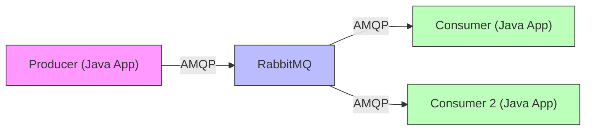
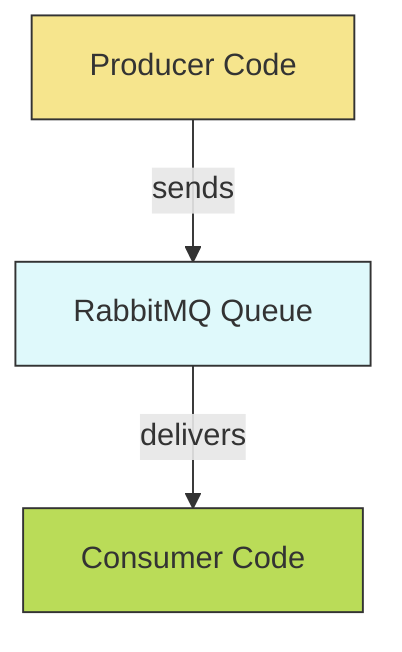
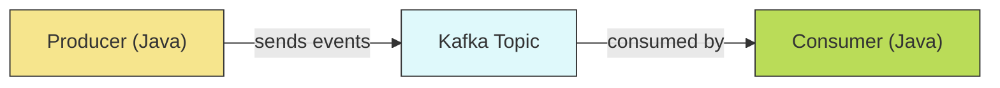
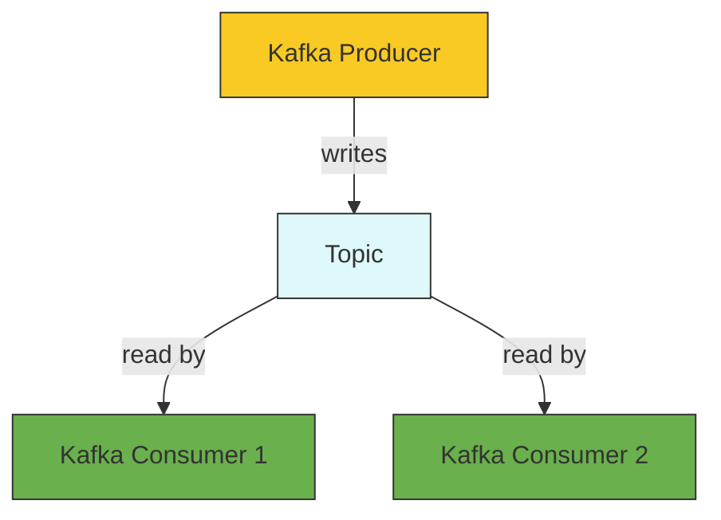

# Message Queues: Concepts, Types, and Hands-on Implementation Guide (RabbitMQ & Kafka in Java)

---

## What is a Message Queue?

A **message queue** is a software communication mechanism that allows different components of a system to send and receive messages asynchronously via a buffer (the queue). Producers send messages to the queue, and consumers read them when ready. This approach enables decoupling, scalability, and reliability in distributed architectures.


---

## Why Do We Need Message Queues?

- **Decoupling:** Producers and consumers don't need to interact directly or operate at the same time.
- **Asynchronous Processing:** Producers can continue their tasks after sending messages.
- **Load Balancing:** Multiple consumers can process messages from the same queue.
- **Reliability:** Messages are stored until processed, even if consumers are temporarily unavailable.
- **Scalability:** Easily add more producers or consumers as workload increases.

---

## When Do We Need Message Queues?

- Integrating microservices or distributed systems.
- Offloading heavy/background tasks (e.g., email, video processing).
- Buffering data spikes or smoothing out traffic (e.g., logging, analytics).
- Ensuring reliable, guaranteed communication between loosely-coupled components.
- Implementing event-driven architectures.

---

## Message Queue Types

### 1. RabbitMQ

- **Model:** Open-source AMQP broker. Uses "exchanges" to route messages to "queues".
- **Use Cases:** Microservices, task queues, event-driven architectures.
- **Advantages:** Flexible routing, reliable, protocol support (AMQP, MQTT, STOMP), mature ecosystem.
- **Disadvantages:** Learning curve for exchanges/queues, not optimized for ultra-high throughput (Kafka is better).

### 2. Apache Kafka

- **Model:** Distributed event streaming platform (publish-subscribe log). Stores events in "topics".
- **Use Cases:** Real-time analytics, log aggregation, streaming.
- **Advantages:** High throughput, persistent storage, scalable, replayable streams.
- **Disadvantages:** Complex to manage, eventual consistency, not ideal for simple tasks.

### 3. Amazon SQS

- **Model:** Fully managed, serverless queue (AWS). Simple API.
- **Use Cases:** Cloud-native/serverless workloads, decoupling AWS Lambda.
- **Advantages:** No infrastructure management, automatic scaling, AWS integration.
- **Disadvantages:** Limited advanced features, AWS lock-in.

### 4. ActiveMQ

- **Model:** Open-source JMS broker; supports multiple protocols.
- **Use Cases:** Java EE, legacy enterprise integration.
- **Advantages:** Mature, good Java integration, supports transactions.
- **Disadvantages:** Lower throughput than Kafka/RabbitMQ, heavyweight for microservices.

### 5. Redis Streams

- **Model:** In-memory data structure for lightweight streaming and pub/sub.
- **Use Cases:** Fast ephemeral tasks, caching, real-time pub/sub.
- **Advantages:** Low latency, simple setup, great as a buffer/cache.
- **Disadvantages:** Not as durable; messages can be lost if not persisted.

### 6. ZeroMQ

- **Model:** Lightweight messaging library (no broker), direct peer-to-peer.
- **Use Cases:** Embedded, low-latency, real-time systems.
- **Advantages:** Minimal overhead, no central broker, flexible patterns.
- **Disadvantages:** No durability or HA, must implement error/retry logic yourself.

---

## Quick Comparison Table

| Type         | Best for                                | Not suited for                        |
|--------------|-----------------------------------------|---------------------------------------|
| RabbitMQ     | Microservices, routing, reliability     | Ultra-high throughput streaming       |
| Kafka        | Analytics, event streaming, log pipelines| Simple task queues, strict ordering   |
| Amazon SQS   | Serverless, AWS users                   | Complex routing, on-prem deployments  |
| ActiveMQ     | Java EE, legacy integration             | Modern high-throughput, cloud-native  |
| Redis Streams| Fast, ephemeral, in-memory tasks        | Persistent, critical messaging        |
| ZeroMQ       | Embedded/real-time, no-broker           | Durable, managed, scalable queues     |

---

## How to Choose

- **Throughput:** Kafka for high rates; RabbitMQ for general use.
- **Durability:** RabbitMQ/Kafka for persistence; Redis for speed.
- **Routing:** RabbitMQ excels; SQS is simple.
- **Management:** SQS is zero-management; RabbitMQ for flexibility.
- **Language Support:** RabbitMQ/ActiveMQ support many languages.
- **Ecosystem:** Match your stack (e.g., SQS for AWS, JMS for Java).

---

# Hands-on: RabbitMQ Java Implementation

This section is a practical step-by-step for getting RabbitMQ running, coding a Java producer/consumer, and learning by doing.

---

## RabbitMQ Basic Architecture


- **Multiple consumers** can receive messages for load balancing and scalability.

---

## 1. Install RabbitMQ (Recommended: Docker)

**Quick Start with Docker:**

```bash
# RabbitMQ 3.x
docker run -d --hostname my-rabbit --name some-rabbit -p 5672:5672 -p 15672:15672 rabbitmq:3-management
```
```bash
# latest RabbitMQ 4.x
docker run -it --rm --name rabbitmq -p 5672:5672 -p 15672:15672 rabbitmq:4-management
```

- Management UI: [http://localhost:15672](http://localhost:15672) (login: `guest` / `guest`)
- AMQP port for Java: `5672`

---

## 2. Java Project Setup

**Maven:**
```xml
<dependency>
  <groupId>com.rabbitmq</groupId>
  <artifactId>amqp-client</artifactId>
  <version>5.21.0</version>
</dependency>
```

**Gradle:**
```groovy
implementation 'com.rabbitmq:amqp-client:5.21.0'
```

---

## 3. application.properties / application.yml

Below are Spring Boot application configuration examples for integrating **RabbitMQ**.

### RabbitMQ (`application.properties`)
```properties
spring.rabbitmq.host=localhost
spring.rabbitmq.port=5672
spring.rabbitmq.username=guest
spring.rabbitmq.password=guest
spring.rabbitmq.virtual-host=/
spring.rabbitmq.listener.simple.acknowledge-mode=auto
spring.rabbitmq.template.exchange=my-exchange
spring.rabbitmq.template.routing-key=my-routing-key
spring.rabbitmq.template.default-receive-queue=my-queue
```

### RabbitMQ (`application.yml`)
```yaml
spring:
  rabbitmq:
    host: localhost
    port: 5672
    username: guest
    password: guest
    virtual-host: /
    listener:
      simple:
        acknowledge-mode: auto
    template:
      exchange: my-exchange
      routing-key: my-routing-key
      default-receive-queue: my-queue
```
## ( OR )

```yaml
spring:
  rabbitmq:
    host: localhost
    port: 5672
    username: guest
    password: guest

  rabbitmq:
    exchange:
      name: my-exchange
    queue:
      name: my-name
    routing:
      key: my-routing-key
```
---

## 4. Java Producer Example

**Send a message to RabbitMQ:**

```java
import com.rabbitmq.client.Channel;
import com.rabbitmq.client.Connection;
import com.rabbitmq.client.ConnectionFactory;
import com.rabbitmq.client.MessageProperties;

public class Producer {
    private final static String QUEUE_NAME = "task_queue";
    public static void main(String[] argv) throws Exception {
        ConnectionFactory factory = new ConnectionFactory();
        factory.setHost("localhost");
        try (Connection connection = factory.newConnection();
             Channel channel = connection.createChannel()) {
            boolean durable = true;
            channel.queueDeclare(QUEUE_NAME, durable, false, false, null);
            String message = "Hello RabbitMQ from Java!";
            channel.basicPublish("", QUEUE_NAME, MessageProperties.PERSISTENT_TEXT_PLAIN, message.getBytes());
            System.out.println(" [x] Sent '" + message + "'");
        }
    }
}
```

**How to run:**  
- Compile and run the `Producer` class.  
- Check the RabbitMQ Management UI (Queues tab) to see your message.

---

## 5. Java Consumer Example

**Receive messages from RabbitMQ:**

```java
import com.rabbitmq.client.*;

public class Consumer {
    private final static String QUEUE_NAME = "task_queue";
    public static void main(String[] argv) throws Exception {
        ConnectionFactory factory = new ConnectionFactory();
        factory.setHost("localhost");
        Connection connection = factory.newConnection();
        Channel channel = connection.createChannel();

        boolean durable = true;
        channel.queueDeclare(QUEUE_NAME, durable, false, false, null);
        System.out.println(" [*] Waiting for messages. To exit press CTRL+C");

        DeliverCallback deliverCallback = (consumerTag, delivery) -> {
            String message = new String(delivery.getBody(), "UTF-8");
            System.out.println(" [x] Received '" + message + "'");
        };
        channel.basicConsume(QUEUE_NAME, true, deliverCallback, consumerTag -> { });
    }
}
```

**How to run:**  
- Start the `Consumer` class before or after the `Producer`.
- You should see received messages printed to your console.

---

## 6. Hands-on Activities: Try It Yourself



1. **Send multiple messages:**  
   Modify the producer to send messages in a loop.

2. **Manual Acknowledgment:**  
   Change `autoAck` to `false` and add `channel.basicAck()` in the consumer for reliability.

3. **Multiple Consumers:**  
   Start more than one consumer and observe load balancing.

4. **Error Handling:**  
   Simulate consumer failures and see how RabbitMQ handles message delivery.

5. **Persistent Messages:**  
   Use `MessageProperties.PERSISTENT_TEXT_PLAIN` in `basicPublish` to persist messages.

---

## ✅ Output Example

Consumer:
```
 [*] Waiting for messages...
 [x] Received 'Hello RabbitMQ from Java!'
```
Producer:
```
 [x] Sent 'Hello RabbitMQ from Java!'
```

---

## 7. Best Practices

- Use **durable queues** and **persistent messages** for reliability.
- Handle **acknowledgments** and errors explicitly.
- Use **separate channels** for each thread.
- **Secure** your broker (authentication, TLS).
- **Monitor** with the RabbitMQ management plugin.

---

# Spring Boot RabbitMQ Java Configuration: Queue, Exchange, Binding, and Listener

This guide shows how to set up RabbitMQ integration in a Spring Boot application using **Java configuration** (no XML!) and best practices for JSON message handling and simple message listening.

---

## 1. Queue, Exchange, and Binding Beans

Define beans for queue, exchange, and binding.  
- Use `DirectExchange` for direct routing.  
- Change to `TopicExchange` or `FanoutExchange` for other patterns as needed.

```java
import org.springframework.amqp.core.*;
import org.springframework.beans.factory.annotation.Value;
import org.springframework.context.annotation.Bean;
import org.springframework.context.annotation.Configuration;

@Configuration
public class RabbitMQConfig {

    @Value("${rabbitmq.exchange.name}")
    private String exchangeName;

    @Value("${rabbitmq.queue.name}")
    private String queueName;

    @Value("${rabbitmq.routing.key}")
    private String routingKey;

    @Bean
    public Queue queue() {
        return new Queue(queueName, true); // durable queue
    }

    @Bean
    public DirectExchange exchange() {
        return new DirectExchange(exchangeName);
    }

    @Bean
    public Binding binding(Queue queue, DirectExchange exchange) {
        return BindingBuilder
                .bind(queue)
                .to(exchange)
                .with(routingKey);
    }
}

```
> ℹ️ **Tip:**  
> - For a topic exchange: `new TopicExchange(EXCHANGE)`
> - For a fanout exchange: `new FanoutExchange(EXCHANGE)`

---

## 2. Message Converter (Optional but Recommended)

To send/receive JSON instead of raw bytes, use a Jackson-based converter.

```java
import org.springframework.amqp.support.converter.Jackson2JsonMessageConverter;
import org.springframework.amqp.support.converter.MessageConverter;
import org.springframework.amqp.rabbit.core.RabbitTemplate;
import org.springframework.amqp.rabbit.connection.ConnectionFactory;
import org.springframework.context.annotation.Bean;

@Bean
public MessageConverter jsonMessageConverter() {
    return new Jackson2JsonMessageConverter();
}

@Bean
public RabbitTemplate rabbitTemplate(ConnectionFactory connectionFactory) {
    RabbitTemplate template = new RabbitTemplate(connectionFactory);
    template.setMessageConverter(jsonMessageConverter());
    return template;
}
```
- This enables easy serialization/deserialization of POJOs as JSON.

---

## 3. RabbitMQ Listener (Consumer) with Spring

Use `@RabbitListener` to make a simple message consumer.

```java
import org.springframework.amqp.rabbit.annotation.RabbitListener;
import org.springframework.stereotype.Component;

@Component
public class MyRabbitListener {

    @RabbitListener(queues = RabbitMQConfig.QUEUE)
    public void receiveMessage(String message) {
        System.out.println(" [x] Received: " + message);
    }
}
```
- Spring automatically creates a listener container for you.
- Message payload can be a `String`, POJO, or byte[] (depending on your converter).

---

## 4. Example application.properties for RabbitMQ

```properties
spring.rabbitmq.host=localhost
spring.rabbitmq.port=5672
spring.rabbitmq.username=guest
spring.rabbitmq.password=guest
```

---

## 5. How it works (Flow Diagram)


---


# Hands-on: Apache Kafka Java Implementation

Kafka is better suited for high-throughput, event streaming, and log pipelines. Below is a step-by-step guide for a basic Java Kafka Producer and Consumer.

---

## Kafka System Architecture



---

## 1. Kafka Installation (Recommended: Docker)

**Run Kafka + Zookeeper with Docker Compose:**

```yaml
# docker-compose.yml 
version: '3.8'
services:
  zookeeper:
    image: confluentinc/cp-zookeeper:7.6.0
    environment:
      ZOOKEEPER_CLIENT_PORT: 2181
      ZOOKEEPER_TICK_TIME: 2000
    ports:
      - "2181:2181"

  kafka:
    image: confluentinc/cp-kafka:7.6.0
    depends_on:
      - zookeeper
    ports:
      - "9092:9092"
    environment:
      KAFKA_BROKER_ID: 1
      KAFKA_ZOOKEEPER_CONNECT: zookeeper:2181
      KAFKA_ADVERTISED_LISTENERS: PLAINTEXT://localhost:9092
      KAFKA_OFFSETS_TOPIC_REPLICATION_FACTOR: 1

```

Start with:
```bash
docker-compose up -d
```

---

## 2. Java Project Setup

**Maven:**
```xml
<dependency>
  <groupId>org.apache.kafka</groupId>
  <artifactId>kafka-clients</artifactId>
  <version>3.7.0</version>
</dependency>
```

**Gradle:**
```groovy
implementation 'org.apache.kafka:kafka-clients:3.7.0'
```

---

## 3. application.properties / application.yml

Below are Spring Boot application configuration examples for integrating **Kafka**.

### Kafka (`application.properties`)
```properties
spring.kafka.bootstrap-servers=localhost:9092
spring.kafka.consumer.group-id=my-group
spring.kafka.consumer.auto-offset-reset=earliest
spring.kafka.consumer.key-deserializer=org.apache.kafka.common.serialization.StringDeserializer
spring.kafka.consumer.value-deserializer=org.apache.kafka.common.serialization.StringDeserializer
spring.kafka.producer.key-serializer=org.apache.kafka.common.serialization.StringSerializer
spring.kafka.producer.value-serializer=org.apache.kafka.common.serialization.StringSerializer
```

### Kafka (`application.yml`)
```yaml
spring:
  kafka:
    bootstrap-servers: localhost:9092
    consumer:
      group-id: my-group
      auto-offset-reset: earliest
      key-deserializer: org.apache.kafka.common.serialization.StringDeserializer
      value-deserializer: org.apache.kafka.common.serialization.StringDeserializer
    producer:
      key-serializer: org.apache.kafka.common.serialization.StringSerializer
      value-serializer: org.apache.kafka.common.serialization.StringSerializer
```

---

## 4. Kafka Java Producer Example

```java
import org.apache.kafka.clients.producer.KafkaProducer;
import org.apache.kafka.clients.producer.ProducerRecord;
import java.util.Properties;

public class SimpleKafkaProducer {
    public static void main(String[] args) {
        Properties props = new Properties();
        props.put("bootstrap.servers", "localhost:9092");
        props.put("key.serializer", "org.apache.kafka.common.serialization.StringSerializer");
        props.put("value.serializer", "org.apache.kafka.common.serialization.StringSerializer");
        props.put("acks", "all");

        KafkaProducer<String, String> producer = new KafkaProducer<>(props);

        for (int i = 0; i < 5; i++) {
            producer.send(new ProducerRecord<>("test-topic", "key-" + i, "Hello Kafka message " + i));
        }

        producer.flush(); // Push all messages immediately
        producer.close();
        System.out.println("Messages sent to Kafka.");
    }
}
```
**How to run:**  
- Make sure Kafka is running.
- Create the topic:  
  ```bash
  docker exec -it <kafka-container-name> kafka-topics.sh --create --topic test-topic --bootstrap-server kafka:9092
  ```
- Run the producer class.

---

## 5. Kafka Java Consumer Example

```java
import org.apache.kafka.clients.consumer.ConsumerRecords;
import org.apache.kafka.clients.consumer.ConsumerRecord;
import org.apache.kafka.clients.consumer.KafkaConsumer;
import java.util.Arrays;
import java.util.Properties;

public class SimpleKafkaConsumer {
    public static void main(String[] args) {
        Properties props = new Properties();
        props.put("bootstrap.servers", "localhost:9092");
        props.put("group.id", "test-group");
        props.put("key.deserializer", "org.apache.kafka.common.serialization.StringDeserializer");
        props.put("value.deserializer", "org.apache.kafka.common.serialization.StringDeserializer");

        KafkaConsumer<String, String> consumer = new KafkaConsumer<>(props);
        consumer.subscribe(Arrays.asList("test-topic"));
        Runtime.getRuntime().addShutdownHook(new Thread(consumer::close));

        while (true) {
            ConsumerRecords<String, String> records = consumer.poll(java.time.Duration.ofMillis(100));
            for (ConsumerRecord<String, String> record : records) {
                System.out.printf("offset = %d, key = %s, value = %s%n", record.offset(), record.key(), record.value());
            }
        }
    }
}
```
**How to run:**  
- Run the consumer class before or after the producer.
- Observe the messages received.

---

## ✅ Output Example for Kafka

**Producer Output:**
```
Messages sent to Kafka.
```

**Consumer Output:**
```
offset = 0, key = key-0, value = Hello Kafka message 0
offset = 1, key = key-1, value = Hello Kafka message 1
offset = 2, key = key-2, value = Hello Kafka message 2
offset = 3, key = key-3, value = Hello Kafka message 3
offset = 4, key = key-4, value = Hello Kafka message 4
```

- The producer prints a confirmation when messages are sent.
- The consumer prints each message received, showing the Kafka offset, key, and value.

---

## 6. Kafka Hands-on Activities



1. **Send messages with different keys:**  
   See how partitioning works.

2. **Multiple Consumers (same group):**  
   Run several consumer instances and see load balancing.

3. **Replay messages:**  
   Restart the consumer and observe that Kafka retains message history.

4. **Change topic configuration:**  
   Create topics with more partitions, test scaling.

---

## 7. Best Practices for Kafka

- Set `acks=all` in producer config for strongest durability.
- Use **replication** for fault-tolerance (production).
- Monitor with **Kafka Manager**, **Prometheus**, or **JMX**.
- Tune partitions and consumers for scaling.
- Secure Kafka using SASL/SSL in production.
- Use compacted topics for event-sourcing patterns.

---


## FAQ

**Q: When to use RabbitMQ vs. Kafka?**  
A: RabbitMQ is great for reliable, flexible messaging and routing; Kafka excels at high-throughput event streaming and analytics.

**Q: Can I use both in one project?**  
A: Yes! Sometimes RabbitMQ handles transactional tasks and Kafka manages analytics/logging.

**Q: How do I ensure no lost messages?**  
A: Use durable queues (RabbitMQ), persistent messages, manual ack, and configure Kafka for strong delivery guarantees.

**Q: Can I use Spring Boot with RabbitMQ or Kafka?**  
A: Yes! Spring AMQP for RabbitMQ, Spring Kafka for Kafka—both provide easy integration.

---

## Conclusion

**Message queues** are essential for modern, scalable, and robust distributed systems.  
- **RabbitMQ** is ideal for microservices and reliable, flexible messaging.
- **Kafka** is the go-to choice for high-throughput, persistent event streaming.

---
