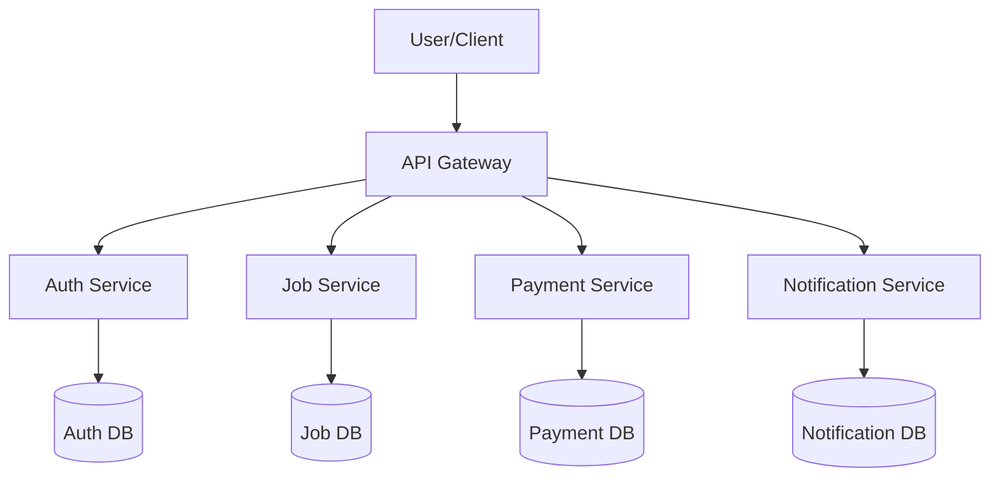

# 🧩 Microservices: The Complete Beginner Guide

## What is Microservices?
Microservices is a modern software architecture style where a large application is built as a collection of small, independent, and loosely coupled services. Each service:

-> Handles one specific task or business capability.

-> Has its own database, logic, and API.

-> Is developed, deployed, and scaled independently.

---

## 🌍 Real-World Examples (Easy to Imagine!)

### 1️⃣ **Islands & Bridges**
- Each **island** is a microservice with its own house, food, and rules.
- **Bridges** are the roads (APIs) that let people (data) travel between islands.
- If one island floods (fails), the others are safe and still work.

### 2️⃣ **Fast Food Restaurant**
- **Order Counter** = API Gateway (takes all orders)
- **Burger Station**, **Fries Station**, **Drinks Station** = Microservices (each makes its own thing)
- Each station works alone but together they make your meal.

### 3️⃣ **School with Different Departments**
- **Math Department**, **Science Department**, **Art Department** = Microservices
- Each department has its own teachers (logic) and books (data).
- Students (requests) go to the right department for help.

---

## 🖥️ Simple Microservices Architecture Diagram

- **User/Client:** The person or app using your service (like a phone app).
- **API Gateway:** The front door. It sends requests to the right microservice.
- **Microservices:** Each box does one job (auth, jobs, payments, etc.), each with its own database.

---

## 📜 Microservices Core Principles

1. **Single Responsibility Principle:**  
   Each microservice handles one specific business task (e.g., Company Management, Job Posting).

2. **Service Independence:**  
   Services are loosely coupled and can be developed, deployed, and scaled independently.

3. **Decentralized Data Management:**  
   Each service **owns its data**, with **no shared database** — encouraging autonomy and reducing tight coupling.

4. **Failure Isolation:**  
   If one service fails, it doesn’t bring down the entire system (using retries, circuit breakers, etc.).

5. **Continuous Integration / Continuous Deployment (CI/CD):**  
   Microservices benefit from automation tools:
   - **GitHub Actions**, Jenkins, GitLab CI for CI/CD pipelines
   - **Docker & Kubernetes** for containerization and orchestration
   - **Prometheus + Grafana** for monitoring

6. **Well-Defined Interfaces & Documentation:**  
   - Services expose **versioned APIs** (REST/gRPC)
   - Documented via tools like **Swagger/OpenAPI**

---

## 🚀 Why Use Microservices?

| What You Get         | Monolithic App (Old Way)     | Microservices (New Way)              |
|----------------------|------------------------------|--------------------------------------|
| **Grow Easily**      | Must grow the whole app      | Grow just the busy part (easier)     |
| **Pick Tools**       | One language & database      | Use different tools for each service |
| **Updates**          | Update whole app at once     | Update just one service at a time    |
| **Teamwork**         | All teams share one code     | Teams own their own service          |
| **Safer**            | One error can break all      | One error doesn’t stop everything    |

---

## 🧩 How Do Microservices Work? (Key Ideas)

1. **One Service, One Job:**  
   Each microservice handles a single business task (like Login, Orders, or Payments).

2. **Own Database:**  
   Every service has its own database—no sharing! This keeps things tidy.

3. **Independent:**  
   Teams build and fix their own services. No need to wait for others.

4. **Communicate Clearly:**  
   Services talk using APIs (like REST, gRPC) or messages (like Kafka).

5. **Easy Recovery:**  
   If one service breaks, the rest keep running.

6. **Automated Builds & Tests:**  
   Use tools like GitHub Actions, Docker, and Kubernetes to check and launch updates.

---

## ⚠️ Challenges (and How to Solve Them)

| Problem                | How to Solve It                       |
|------------------------|---------------------------------------|
| Hard to Track Errors   | Use tracing tools (Jaeger, Zipkin)    |
| Data is Everywhere     | Share updates with events (Kafka)     |
| Slow if Too Many Calls | Use fast links (gRPC), keep simple    |
| Hard to Find Services  | Use helpers (Consul, Kubernetes)      |

---

## 🛠️ Popular Tools (You May Hear About)

| What It Does         | Tools You Can Use                           |
|----------------------|---------------------------------------------|
| **API Gateway**      | Kong, Nginx, Apigee                         |
| **Run Services**     | Docker, Kubernetes                          |
| **Send Messages**    | Kafka, RabbitMQ                             |
| **Log & Watch**      | ELK Stack (Elasticsearch, Logstash, Kibana) |
| **Test APIs**        | Swagger, Postman                            |

---

## 📦 Real-Life Companies Using Microservices

**Netflix** → pioneered microservices for streaming

**Amazon** → each team owns and deploys its own microservice

**Uber** → uses microservices for each business module

**Spotify** → separates music, search, user profile, ads, etc.

---

## 📝 Quick Recap

- **Microservices** = many small, simple apps working together
- Each one can use different tools and be updated alone
- If one fails, others keep running
- Good for big apps, lots of users, and fast-moving teams

---

## 📖 Learn More

- **Books:**  
  - "Building Microservices" by Sam Newman  
  - "Monolith to Microservices" by Martin Fowler  
